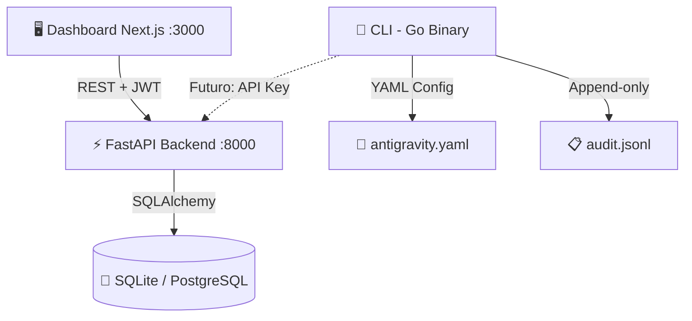
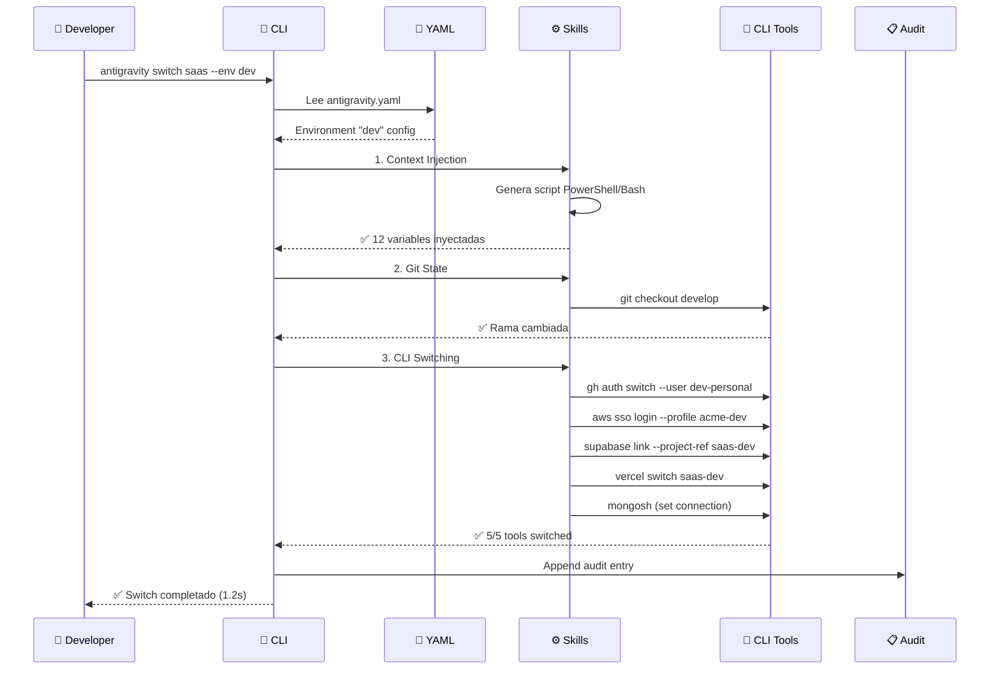
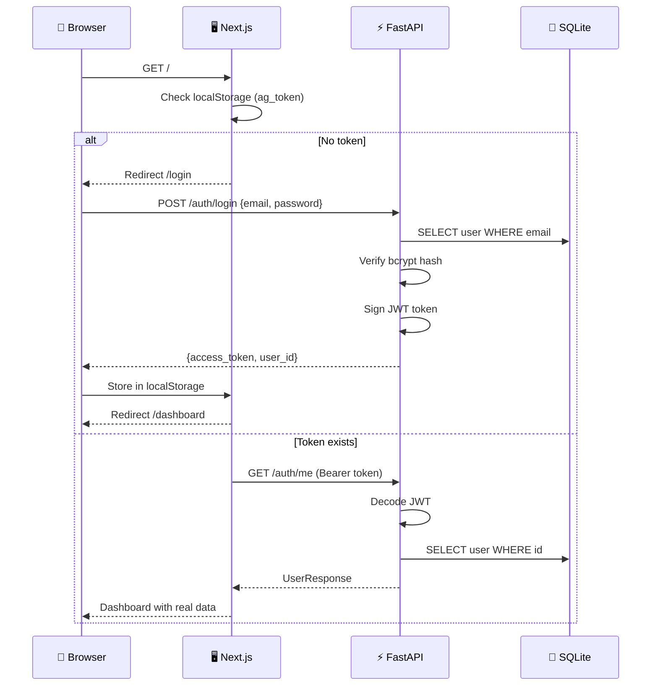
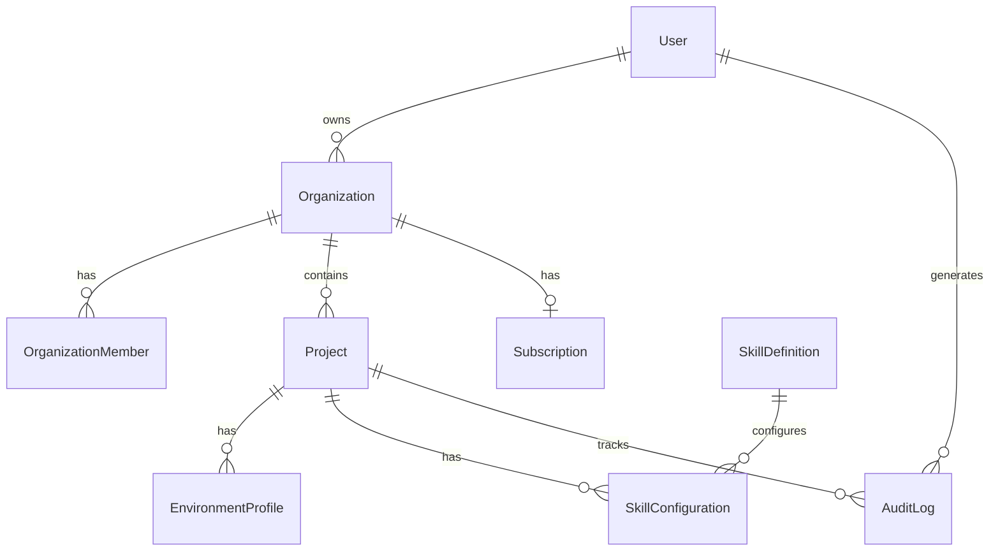

## Vista General



## Componentes

### 1. CLI (Go) — Motor Core

El motor que ejecuta los switches. Arquitectura **hexagonal** con 0 dependencias en el core:

```
core/internal/
├── domain/        → Entidades puras (Project, Skill, CLIProfile)
├── port/          → Interfaces (CLIProfiler, ConfigReader)
├── service/       → Orchestrator (coordina skills)
└── adapter/       → Implementaciones (CLI, Config, Executors, Audit)
```

<Info>
  La arquitectura hexagonal permite añadir nuevos CLI tools sin tocar la lógica de negocio.
  Solo implementas la interface `CLIProfiler`.
</Info>

### 2. Backend API (FastAPI) — Cerebro

API REST con 20+ endpoints, autenticación JWT, y validación Pydantic v2:

```
api/app/
├── models/       → SQLAlchemy ORM (9 tablas)
├── schemas/      → Pydantic v2 request/response
├── services/     → Lógica de negocio + freemium
├── routers/      → Endpoints REST (6 routers)
└── middleware/   → JWT auth dependency
```

### 3. Dashboard (Next.js) — Interfaz

Dashboard web premium con dark mode, conectado al API en tiempo real:

```
dashboard/src/
├── app/          → App Router (login, dashboard, projects, audit, settings)
├── components/   → shadcn/ui + custom
└── lib/          → API client tipado + AuthProvider
```

## Flujo de un Context Switch



## Flujo de Autenticación (Dashboard)



## Modelo de Datos



## Decisiones de Diseño

<AccordionGroup>
  <Accordion title="¿Por qué Go para el CLI?" icon="golang">
    - **Binarios estáticos** sin runtime dependencies
    - **Cross-compilation** trivial (Windows, Mac, Linux)
    - **Cobra CLI** es el estándar de la industria (kubectl, gh, docker)
    - **Rendimiento** cercano a C sin la complejidad de Rust
  </Accordion>
  <Accordion title="¿Por qué FastAPI para el API?" icon="python">
    - **Pydantic v2** con validación automática a nivel de schema
    - **Swagger UI** auto-generado sin código adicional
    - **Async nativo** para concurrencia alta con SQLAlchemy 2.0
    - **Ecosystem Python** amplio para ML/AI features futuros
  </Accordion>
  <Accordion title="¿Por qué SQLite primero?" icon="database">
    - **0 dependencias** externas para desarrollo local
    - **Migración a PostgreSQL** = cambiar 1 línea en `.env`
    - Los modelos SQLAlchemy son **agnósticos al motor**
  </Accordion>
  <Accordion title="¿Por qué JWT local en vez de Supabase Auth?" icon="lock">
    - **Desarrollo offline** sin depender de servicios externos
    - La interfaz es idéntica: `Authorization: Bearer {token}`
    - **Swap a Supabase Auth** = cambiar solo el middleware de validación
  </Accordion>
  <Accordion title="Seguridad Zero-Knowledge" icon="shield">
    Los secretos del usuario se encriptan localmente con AES-256-GCM, derivando la clave con Argon2id de la master password. **El servidor nunca ve la master password ni los secretos en claro.**
  </Accordion>
</AccordionGroup>
